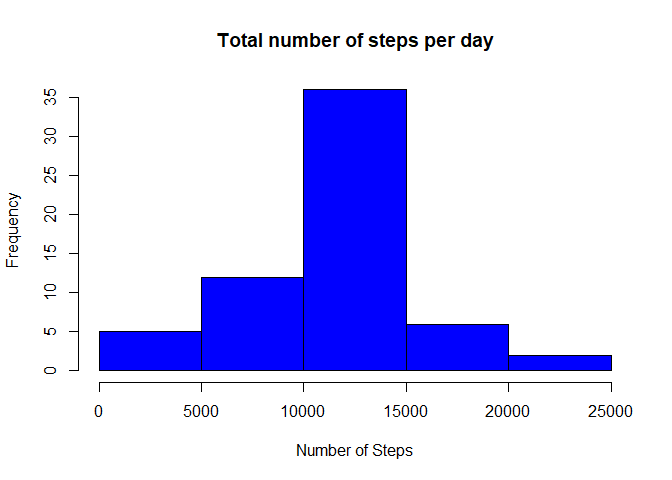
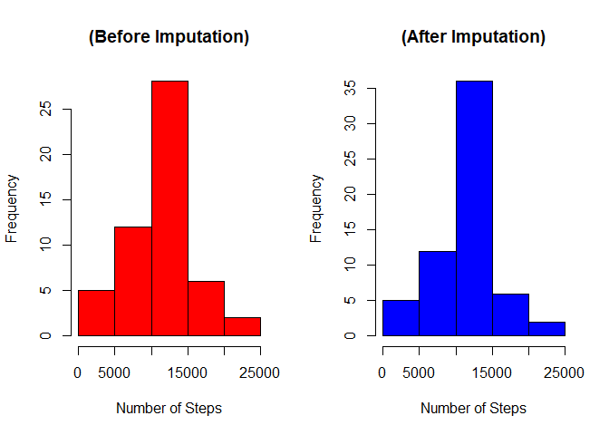
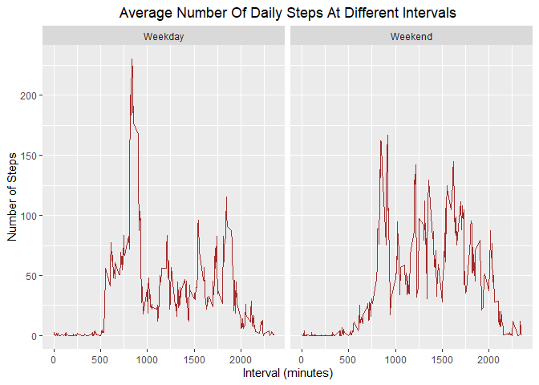

## Loading and preprocessing the data

```r
unzip("activity.zip")

activity <- read.csv("activity.csv", 
                     colClasses = c("integer", "Date", "integer"), 
                     na.strings = "NA")
summary(activity)
```

```
##      steps             date               interval     
##  Min.   :  0.00   Min.   :2012-10-01   Min.   :   0.0  
##  1st Qu.:  0.00   1st Qu.:2012-10-16   1st Qu.: 588.8  
##  Median :  0.00   Median :2012-10-31   Median :1177.5  
##  Mean   : 37.38   Mean   :2012-10-31   Mean   :1177.5  
##  3rd Qu.: 12.00   3rd Qu.:2012-11-15   3rd Qu.:1766.2  
##  Max.   :806.00   Max.   :2012-11-30   Max.   :2355.0  
##  NA's   :2304
```


## What is mean total number of steps taken per day?

```r
# Ignore missing values
DF1 <- activity[!is.na(activity$steps),]

# Get total Steps for each day
Steps <- data.frame(total_Steps = tapply(DF1$steps, DF1$date, sum))
Steps$Date <- as.Date(rownames(Steps))

# Histogram Plot
hist(Steps$total_Steps, col = 'red', 
     main="Total Number Of Steps Per Day", 
     xlab="Total Number of Steps")
```

<!-- -->

```r
# Summary of Mean & Median # of steps/day
meanSteps <- mean(Steps$total_Steps)
medianSteps <- median(Steps$total_Steps)
cat("Mean Daily Steps: ", meanSteps, "Steps")
```

```
## Mean Daily Steps:  10766.19 Steps
```

```r
cat("Median Daily Steps: ",medianSteps, "Steps")
```

```
## Median Daily Steps:  10765 Steps
```

## What is the average daily activity pattern?

```r
meanStepsInterval <- aggregate(steps ~ interval, DF1, mean)
head(meanStepsInterval)
```

```
##   interval     steps
## 1        0 1.7169811
## 2        5 0.3396226
## 3       10 0.1320755
## 4       15 0.1509434
## 5       20 0.0754717
## 6       25 2.0943396
```

```r
# Histogram Plot
library("ggplot2")
ggplot(data = meanStepsInterval, aes(x = interval, y = steps)) +
        geom_line() +
        ggtitle("Average Daily Activity Pattern") +
        theme(plot.title = element_text(hjust = 0.5)) +
        xlab("Interval (minutes)") + 
        ylab("Average Number of Steps")
```

<!-- -->

```r
max_interval <- meanStepsInterval[which.max(meanStepsInterval$steps),]
max_interval
```

```
##     interval    steps
## 104      835 206.1698
```
        
* As shown in the figure above, Time interval "**[835]**" contains the overall maximum number of steps **(~ 206 steps / day)**.


## Imputing missing values

```r
# 1- Total Number of Missing values
sum(is.na(activity))
```

```
## [1] 2304
```
##### Total Number of Rows with NAs = **2304 rows**


```r
# 2- Filling Missing Values with mean steps in each interval
# 3- Create a new dataset with filled NA values
newData <- activity
for(row in 1: nrow(activity)) {
        if(is.na(newData[row, 1])==TRUE) {
                newData[row, 1] <- meanStepsInterval[meanStepsInterval$interval %in%                                              newData[row, 3], 2]
        }
}

head(newData)
```

```
##       steps       date interval
## 1 1.7169811 2012-10-01        0
## 2 0.3396226 2012-10-01        5
## 3 0.1320755 2012-10-01       10
## 4 0.1509434 2012-10-01       15
## 5 0.0754717 2012-10-01       20
## 6 2.0943396 2012-10-01       25
```


```r
# 4- Histogram Plot
totalSteps <- aggregate(steps ~ date, newData, sum)
head(totalSteps)
```

```
##         date    steps
## 1 2012-10-01 10766.19
## 2 2012-10-02   126.00
## 3 2012-10-03 11352.00
## 4 2012-10-04 12116.00
## 5 2012-10-05 13294.00
## 6 2012-10-06 15420.00
```

```r
# Histogram Plot 
hist(totalSteps$steps, col = 'Blue', 
     main="Total number of steps per day", 
     xlab="Number of Steps")
```

<!-- -->

```r
# Mean - Median # of steps
meanSteps <- mean(totalSteps$steps)
medianSteps <- median(totalSteps$steps)
cat("Mean Daily Steps: ", meanSteps, "Steps")
```

```
## Mean Daily Steps:  10766.19 Steps
```

```r
cat("Median Daily Steps: ",medianSteps, "Steps")
```

```
## Median Daily Steps:  10766.19 Steps
```

### Comparison Between Data [ Before Imputation Vs After Imputation ]

```r
par(mfrow = c(1,2))

# Histogram Plot 1
hist(Steps$total_Steps, col = 'red', 
     main="(Before Imputation)", 
     xlab="Number of Steps")

# Histogram Plot 2
hist(totalSteps$steps, col = 'Blue', 
     main="(After Imputation)", 
     xlab="Number of Steps")
```

<!-- -->

* **Q1: Do these values differ from the estimates from the first part of the assignment?**  
--> We can see that the **frequency** of values near to the mean number of daily steps has **increased** because we've imputed the missing values with **mean** of each interval.

* **Q2: What is the impact of imputing missing data on the estimates of the total daily number of steps?**  
--> After imputing missing data, the total number of steps in each day has slightly **increased** because at some days there were a lot of **NA's**; but now We've replaced them with the **(Mean # of steps within the time interval)** that will be added to the total number of daily steps.

## Are there differences in activity patterns between weekdays and weekends?

```r
weekdays <- c("Monday", "Tuesday", "Wednesday", "Thursday", 
              "Friday" )
newData$Day = as.factor(ifelse(is.element(weekdays(as.Date(newData$date)),weekdays), "Weekday", "Weekend"))
Final <- aggregate(steps ~ interval + Day, newData, mean)
head(Final)
```

```
##   interval     Day      steps
## 1        0 Weekday 2.25115304
## 2        5 Weekday 0.44528302
## 3       10 Weekday 0.17316562
## 4       15 Weekday 0.19790356
## 5       20 Weekday 0.09895178
## 6       25 Weekday 1.59035639
```

```r
library("ggplot2")
ggplot(Final, aes(interval, steps)) +
        geom_line(col = 'brown') + 
        facet_grid(.~Day) + 
        xlab("Interval (minutes)") +
        ylab("Number of Steps") + 
        ggtitle("Average Number Of Daily Steps At Different Intervals")+
        theme(plot.title = element_text(hjust = 0.5))
```

<!-- -->
