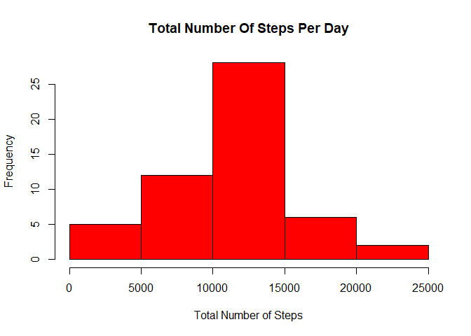
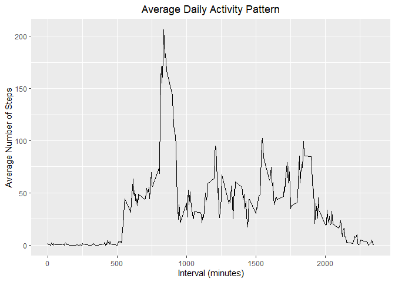

## Loading and preprocessing the data

```r
unzip("activity.zip")

activity <- read.csv("activity.csv", 
                     colClasses = c("integer", "Date", "integer"), 
                     na.strings = "NA")
summary(activity)
```

```
##      steps             date               interval     
##  Min.   :  0.00   Min.   :2012-10-01   Min.   :   0.0  
##  1st Qu.:  0.00   1st Qu.:2012-10-16   1st Qu.: 588.8  
##  Median :  0.00   Median :2012-10-31   Median :1177.5  
##  Mean   : 37.38   Mean   :2012-10-31   Mean   :1177.5  
##  3rd Qu.: 12.00   3rd Qu.:2012-11-15   3rd Qu.:1766.2  
##  Max.   :806.00   Max.   :2012-11-30   Max.   :2355.0  
##  NA's   :2304
```


## What is mean total number of steps taken per day?

```r
# Ignore missing values
DF1 <- activity[!is.na(activity$steps),]

# Get total Steps for each day
Steps <- data.frame(total_Steps = tapply(DF1$steps, DF1$date, sum))
Steps$Date <- as.Date(rownames(Steps))

# Histogram Plot
hist(Steps$total_Steps, col = 'red', 
     main="Total Number Of Steps Per Day", 
     xlab="Total Number of Steps")
```

<!-- -->

```r
# Summary of Mean & Median # of steps/day
meanSteps <- mean(Steps$total_Steps)
medianSteps <- median(Steps$total_Steps)
cat("Mean Daily Steps: ", meanSteps, "Steps")
```

```
## Mean Daily Steps:  10766.19 Steps
```

```r
cat("Median Daily Steps: ",medianSteps, "Steps")
```

```
## Median Daily Steps:  10765 Steps
```

## What is the average daily activity pattern?

```r
meanStepsInterval <- aggregate(steps ~ interval, DF1, mean)
head(meanStepsInterval)
```

```
##   interval     steps
## 1        0 1.7169811
## 2        5 0.3396226
## 3       10 0.1320755
## 4       15 0.1509434
## 5       20 0.0754717
## 6       25 2.0943396
```

```r
# Histogram Plot
library("ggplot2")
ggplot(data = meanStepsInterval, aes(x = interval, y = steps)) +
        geom_line() +
        ggtitle("Average Number of daily steps at different Intervals") +
        xlab("Interval (minutes)") + 
        ylab("Average Number of Steps")
```

<!-- -->

```r
max_interval <- meanStepsInterval[which.max(meanStepsInterval$steps),]
max_interval
```

```
##     interval    steps
## 104      835 206.1698
```
        
* As shown in the figure above, Time interval "**[835]**" contains the overall maximum number of steps **(~ 206 steps / day)**.


## Imputing missing values

```r
# 1- Total Number of Missing values
sum(is.na(activity))
```

```
## [1] 2304
```
* Number of missing rows = **2304 rows**


## Are there differences in activity patterns between weekdays and weekends?
